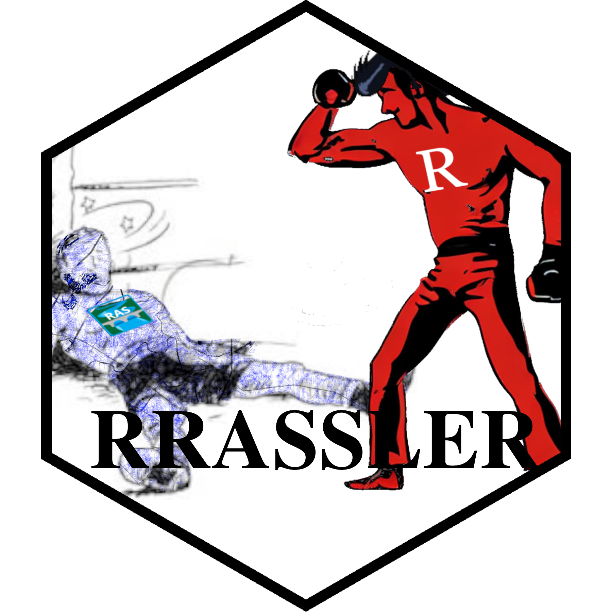

# pkgdown 


<!-- badges: start -->

[](https://lifecycle.r-lib.org/articles/stages.html#experimental)
[](https://choosealicense.com/licenses/mit/)
[](https://www.repostatus.org/#active)
<!-- badges: end -->

# Executive Summary

The HEC-RAS model format, both as stand alone models or in archive
formats, are incompatible for end users whose use case includes
widespread accounting and deployment of that data as inputs into other
workflows. This tool should be deployed to ingest HEC-RAS models into a
“HECRAS_model_catalog”, a normalized and spatialized representation of
those models with the requisite metadata and formatted structure needed
to mesh more seamlessly with [national scale hydrofabric efforts and
data
models](https://noaa-owp.github.io/hydrofabric/articles/cs_dm.html), and
applications such as [T-Route](https://github.com/NOAA-OWP/t-route) and
[RAS2FIM](https://github.com/NOAA-OWP/ras2fim). See the [package
documentation](https://NOAA-OWP.github.io/RRASSLER/), and the [repo
itself](https://github.com/NOAA-OWP/RRASSLER), for more details.

# Installation

As the badges above indicate, this package is Active and experimental,
although the core logic of record creation has been stabilized. If that
cutting edge nature doesn’t dissuade you, install the development
version of [RRASSLER from GitHub](https://github.com/NOAA-OWP/RRASSLER)
with:

``` r
# install.packages("devtools")                  # You only need this if this is your very first time opening RStudio
# install.packages("BiocManager")               # You only need this if this is your very first time opening RStudio
# BiocManager::install("rhdf5")                 # You only need this if this is your very first time opening RStudio
# utils::remove.packages("RRASSLER")            # You only need to run this if you have a previous install and need to wipe it
remotes::install_github("NOAA-OWP/RRASSLER")    # If it asks for package updates: press 1
library(data.table)
RRASSLER::marco()                           # A "hello world" test
```

> Note: RRASSLER generates data as part of it’s processing. Although
> every effort has been made to ensure that the form of that data is not
> so inflexible that future bug-fixes and enhancements break the
> resulting structure, we can make no guarantee that changes made,
> particularly to parsing process and accuracy, edge case handling, and
> ultimately accounting; would not require “reprocessing” records,
> something that is best accomplished using the original data. As noted
> above, this package and several of it’s cohort are still actively
> being developed. Although the core logic of record creation has been
> stabilized for the time being, the “final” form of these tables is
> still in flux.

# Tutorials

There are several tutorials available at the [Article
index](https://NOAA-OWP.github.io/RRASSLER/articles/index.html)
including:

- [Data
  Model](https://NOAA-OWP.github.io/RRASSLER/articles/RRASSLER-format.html):
  The data standard we are building to.
- [Ingest
  steps](https://NOAA-OWP.github.io/RRASSLER/articles/ingest-steps.html):
  What RRASSLER is doing to data?
- [Deploying
  RRASSLER](https://NOAA-OWP.github.io/RRASSLER/articles/deploying-rrassler.html):
  How to make your own “HEC-RAS model catalog”.
- [Mapping
  RRASSLER](https://NOAA-OWP.github.io/RRASSLER/articles/mapping-rrassler.html):
  Adding (geographic) context to our data.

See the [package
documentation](https://NOAA-OWP.github.io/RRASSLER/index.html) for
[function
references](https://NOAA-OWP.github.io/RRASSLER/reference/index.html)
and additional information.

## Explanations

### Statement of need

There are few hydraulic models as prolific as HEC-RAS, and since it’s
first named release in 1995 users have created these models using public
and private data and countless hours of engineering scrutinization in
order to generate the best possible purpose-built representation of the
world. Like any model, some level of input massaging is necessary in
order to get the data into the specified mathematical format a model
requires. Like most domain specific software solutions, that massaging
was rather, forceful, to the point of permanently altering the shape of
those inputs into something that most geospatial data readers are unable
to handle. This creates a great deal of friction both in terms of model
accountability and interoperability, particularly when you take the
standpoint as a model consumer. The R based HEC-RAS Wrestler (RRASSLER)
is here to mediate that. By internally versioning and aligning data and
pointers, the resulting structure provides a bottoms up approach
amenable to walking continental scale applications back to the specific
point, cross section, and HEC-RAS model they were sourced from.

## Discussion

### I am both an archivist/model creator and a RRASSLER user

You will unfortunately have to keep two copies of the data. RRASSLER
isn’t creating anything you don’t already have in the archive in one
form or another, and completely removes all metadata and formatting that
your archive has so painstakingly created. Don’t change your workflow,
consider RRASSLER a “post-processing” step to your archiving work, whose
primary purpose is to make a selection of your models more amenable to
operational deployments.

#### Limitations

Aligning the different model surfaces is hard. Although every effort was
made to account for standard edge cases and unit cohesion, you will,
more often than not, find that a surface you use and a model do not
align. That is not particularly surprising, but it is often
disconcerting. 3DEP timestamps, resolutions, and even order of
reprojection operations may alter the surfaces slightly, even if they
are stated to have come from the same input database. Do your own sanity
checks and try not to lose your mind, it’s probably easier to go out and
measure it again. Finally, this was developed, tested, and deployed over
primarily 1D data. Although 2D model may appear to ingest correctly,
there was no consideration for those in either parsing or processing,
and is not accounting or copying *.tif* files so the value of these
models is greatly diminished.

#### Getting involved

If you have questions, concerns, bug reports, etc, please file an issue
in this repository’s Issue Tracker. I know we are not the only ones
attempting to align the world. General instructions on *how* to
contribute can be found at [CONTRIBUTING](CONTRIBUTING.md). More
specifically, the following are known shortcomings and next steps.

### A few next steps

##### Hardening and extention

Efforts to harden the workflow and algorithm, extend this workflow into
your language of choice, and general improvements would all be uses of
time.

##### 2D RRASSLER

Many of the same considerations, concerns, and hurdles experienced
working with and manipulating 1D RAS data will be encountered as we move
into 2D model accounting. While many of the technical advancements and
standards make the accounting of 2D models a bit more theoretically
straightforward; since most valuable and standardized 2D models come
with an associated *.tif* file which is footprintable, and new model
formats are provided as *.HDF*, which has cloud compatible
characteristics and is being developed, the actual work of constructing
the utility which would account for those models needs to be done.

### Dependencies

This was written tested, and partially deployed using using
[rocker-versioned2](https://github.com/rocker-org/rocker-versioned2).
Typically deployed via package installation on an
[RStudio](https://posit.co/downloads/) instance and alongside [a RAS2FIM
conda
environment](https://github.com/NOAA-OWP/ras2fim/blob/dev/doc/INSTALL.md)
in Windows.

## Open source licensing info

1.  [TERMS](TERMS.md)
2.  [LICENSE](LICENSE)

## Credits and references

Credit to the packages used in the development, testing, and deployment
of RRASSLER including but not exclusive of the following: *AOI, arrow,
cowplot, data.table, dplyr, ggplot2, glue, gmailr, httr, leafem,
leaflet, leafpop, lubridate, lwgeom, mapview, nhdplusTools, sf,
sfheaders, stringi, stringr, tidyr, unglue, units, utils, and rhdf5*. We
are appreciative of the [FEMA region 6 group and the BLE
data](https://webapps.usgs.gov/infrm/estBFE/) they make publicly
available. Built copying patterns from
[RAS2FIM](https://github.com/NOAA-OWP/ras2fim/blob/dev/src/create_shapes_from_hecras.py).

### For questions

[Jim Coll](james.coll@noaa.gov) (FIM Developer), [Fernando
Salas](fernando.salas@noaa.gov) (Director, OWP Geospatial Intelligence
Division)
