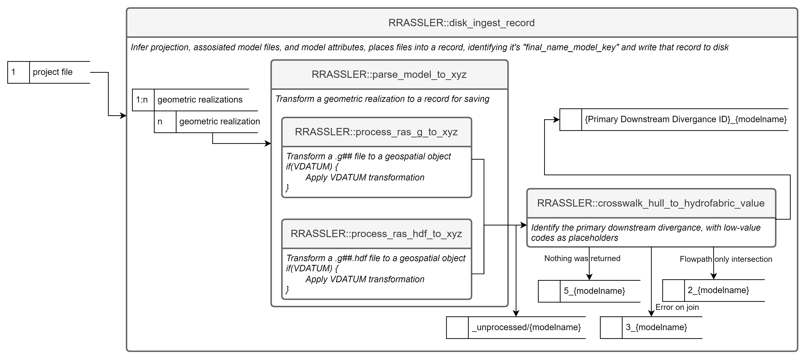
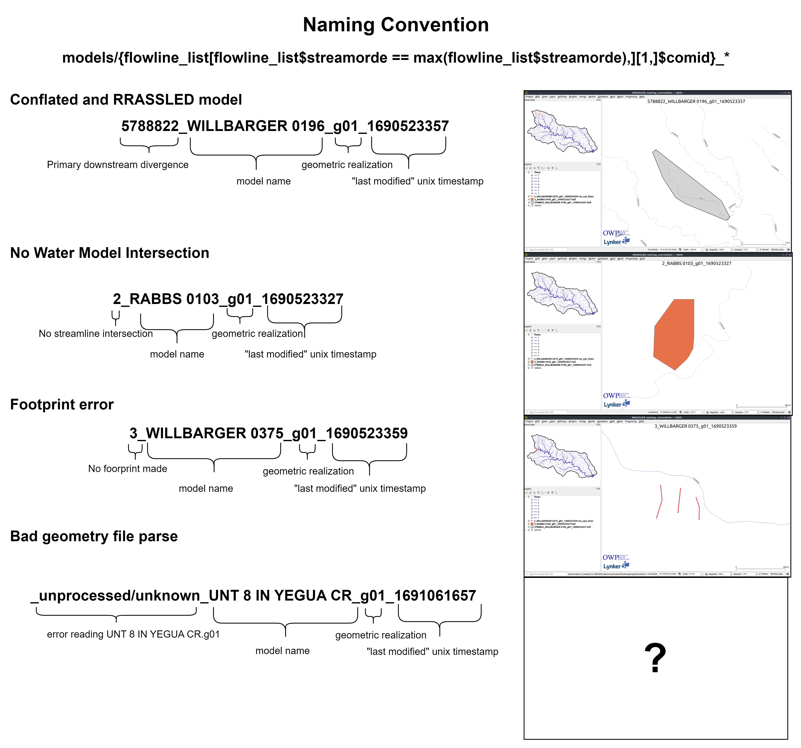

# Making an "RRASSLE'd Catalog"

Despite our efforts not to recreate an "archive" or "library" of HEC-RAS models, it's clear that wide scale deployment of HEC-RAS models as inputs to other workflows requires some form of tracking if we hope to maintain reproducibility and accountability.  While formal archives from individuals and organizations might internally align, adding models from outside sources is difficult or impossible due to the differences in the objectives that the archives were aiming to accomplish and formats different model producers use.  It's also non-trivial and requires discovery and processing to answer questions like "What models are available for my area of interest?" or "Do we have this model in our catalog?"  This friction gave rise to RRASSLER.  By reducing the form of the HEC-RAS data to a unique catalog entry and adding cloud-accessible data helpers, we can arbitrarily and blindly be handed a HEC-RAS model and place that into the resulting framework or otherwise account it.  This predictable and indexable form gives users who need models a standardized starting spot off which to build their own processes.

### Ingest logic

In order to wrassle that friction, RRASSLER has a few theoretical value judgments that need to be described in order to help understand why it does what it does and how to use it properly.  RRASSLER is focused on making the critical data objects needed to run a HEC-RAS model readily available and accountable as a model, as opposed to as individual data points or large clusters of otherwise "vistigal" data; and with an emphasis on the particular geometric realization of the model.  It is also designed to be a standardized and centralized source of models, regardless of their origin.  For that reason, RRASSLER expects to operate within it's own controlled directory, or "HECRAS_model_catalog".   Users first download and unpack desired models into a temporary location, and then point RRASSLER at that directory and the place which you want to store your catalog.  It will:  

1) Greedly scrape the entire directory structure for any HEC-RAS model projects  (defined as *.prj)
2) for each geometric realization of that model (variation of *.g##), grab all files such that:  

| File grep Pattern (# denotes single numeric wildcard) | HEC-RAS Model Use                                                          |
|-------------------------------------------------------|----------------------------------------------------------------------------|
| .g##                                                  | Geometry definitions                                                       |
| .prj                                                  | Projection (can be non-standard proj4 string defined file)                 |
| .prj                                                  | Project (same extension, defines how RAS models are wired)                 |
| .p##                                                  | Plan file, used to drive the model                                         |
| .f##                                                  | Steady Flow file. Profile information, flow data and boundary conditions   |
| .h##                                                  | Hydraulic Design data file                                                 |
| .v##                                                  | Velocity file                                                              |
| .o##                                                  | Output file                                                                |
| .r##                                                  | Run file for steady flow                                                   |
| .u##                                                  | unsteady Flow file. Profile information, flow data and boundary conditions |
| .x##                                                  | Run file for unsteady flow                                                 |
| .dss                                                  | Data files                                                                 |
| .rasmap                                               | Output plan                                                                |

3) Attempt to place the model in space.  This is done by attempting to parse the g** and g**.hdf files, intelligently guess at projections, and pulling and collating the data into an xid-xyz table. 
4) Using that extracted geometry, attempt to create a model footprint (hull).
    5) If that process errors out, the model is appended with a 3_, and placed into the catalog.  The resulting extracted geometry will allow you to determine why a footprint was unable to be created.
    6) If the hull was created, we then attempt to joint that model the the reference hydrofabric and locate the "Primary downstream divergence" (the first COMID from the maximum levelpath underneath that footprint).  If that process errors out for any reason, the model is appended with a 1_, 
    7) If there was no feature to join, the model is 
    8) If the model was joined, the ID of the primary downstream divergence is appended to the model key.
    9) If that can be constructed, the model was assumed to be correctly placed in space.  The relevant model files are copied to the uniquely parsed "final_model_name_key" folder under the _/models/_ folder.  
5) If the creation of the model hull errors out, the model is placed in the _/models/_unprocessed_ folder for further investigation, correction, and rewrassling.
6) After all iterations of files are done, RRASSLER will (re)generate a unified source for model footprints, cross sections, and points (now in spatial form) from the HEC-RAS model, and pointers back to the copied source data which remains unaltered. 

This workflow is loosely diagrammed as follows:



Let's take a look at a few "real life" examples of these outputs and how we should interpret them.



Note that this process is "HECRAS_model_catalog" location agnostic.  Therefore, although you will be operating over local files you may RRASSLE those into ether a local directory or an S3 bucket using the same commands.  RRASSLER also handles all "folder structure" differences between S3 protocols and disk representations, so the "bucket" argument can look just like a folder path or can be the "root" folder in an S3 URL and both are parsed out.

## The "minimal" catalog entry form

As mentioned, the form of the RRASSL'd record is based on hydrofabric specifications with modifications based on the nature of HEC-RAS data as outlined [with Next Gen hydrofabric parameters](https://noaa-owp.github.io/hydrofabric/articles/cs_dm.html).  These are augmented by RAS specific attributes as defined in our standing [cross section data model page](https://noaa-owp.github.io/hydrofabric/articles/RRASSLER-format.html).  See the RRASSLER specific data model page [here](https://NOAA-OWP.github.io/RRASSLER/docs/articles/RRASSLER-format.html).  Slightly more tangibly, when RRASSLER has been run over a model, the record will have the following pattern and schema which you can query (in R) like so:

```{r, eval=FALSE}
ras_dbase <- path/to/catalog
first_model <- list.dirs(file.path(ras_dbase ,"models",fsep = .Platform$file.sep),full.names = F, recursive = F)[2]

> points <- arrow::read_parquet(file.path(ras_dbase ,"models",first_model,"RRASSLER_cs_pts.parquet",fsep = .Platform$file.sep))
> points
     xid xid_length xid_d relative_dist     x     y     z     n source
   <int>        [m] <dbl>         <dbl> <dbl> <dbl> <dbl> <dbl>  <dbl>
 1     1       283.  0          0       -97.2  30.2  180.  0.16      3
 2     1       283.  1.92       0.00679 -97.2  30.2  180.  0.16      3
 3     1       283.  3.99       0.0141  -97.2  30.2  180.  0.16      3
 4     1       283.  5.76       0.0204  -97.2  30.2  180.  0.16      3
 5     1       283.  8.75       0.0309  -97.2  30.2  180.  0.16      3
 6     1       283. 10.5        0.0372  -97.2  30.2  180.  0.16      3
 7     1       283. 12.6        0.0444  -97.2  30.2  180.  0.16      3
 8     1       283. 15.3        0.0540  -97.2  30.2  180.  0.16      3
 9     1       283. 17.0        0.0602  -97.2  30.2  179.  0.16      3
10     1       283. 19.7        0.0695  -97.2  30.2  179.  0.16      3
      
> footprint <- sf::st_read(file.path(ras_dbase ,"models",first_model,"RRASSLER_hull.fgb",fsep = .Platform$file.sep))
Reading layer `RRASSLER_hull' from data source `/.../RRASSLER/inst/extdata/sample_output/ras_catalog/models/5789080_ALUM 107_g01_1691071096/RRASSLER_hull.fgb' using driver `FlatGeobuf'
Simple feature collection with 1 feature and 1 field
Geometry type: POLYGON
Dimension:     XY
Bounding box:  xmin: -97.23015 ymin: 30.20139 xmax: -97.21034 ymax: 30.20904
Geodetic CRS:  NAD83(2011) + NAVD88 height
> footprint
Simple feature collection with 1 feature and 1 field
Geometry type: POLYGON
Dimension:     XY
Bounding box:  xmin: -97.23015 ymin: 30.20139 xmax: -97.21034 ymax: 30.20904
Geodetic CRS:  NAD83(2011) + NAVD88 height
  id                       geometry
1  1 POLYGON ((-97.22841 30.2090...
               
> streamline <- sf::st_read(file.path(ras_dbase ,"models",first_model,"RRASSLER_river.fgb",fsep = .Platform$file.sep))
Reading layer `RRASSLER_river' from data source `/.../RRASSLER/inst/extdata/sample_output/ras_catalog/models/5789080_ALUM 107_g01_1691071096/RRASSLER_river.fgb' using driver `FlatGeobuf'
Simple feature collection with 1 feature and 1 field
Geometry type: LINESTRING
Dimension:     XY
Bounding box:  xmin: -97.22998 ymin: 30.20063 xmax: -97.21019 ymax: 30.21019
Geodetic CRS:  NAD83(2011) + NAVD88 height
> streamline
Simple feature collection with 1 feature and 1 field
Geometry type: LINESTRING
Dimension:     XY
Bounding box:  xmin: -97.22998 ymin: 30.20063 xmax: -97.21019 ymax: 30.21019
Geodetic CRS:  NAD83(2011) + NAVD88 height
  reach_id                       geometry
1        1 LINESTRING (-97.22997 30.21...
                       
> model_metadata <- data.table::fread(file.path(ras_dbase ,"models",first_model,"RRASSLER_metadata.csv",fsep = .Platform$file.sep))
> model_metadata
   nhdplus_comid model_name g_file last_modified      source         units       crs             initial_scrape_name                  final_name_key                                              notes
           <int>     <char> <char>         <int>      <char>        <char>    <char>                          <char>                          <char>                                             <char>
1:       5789080   ALUM 107    g01    1691071096 test: FEMA6 English Units EPSG:2277 5789080_ALUM 107_g01_1691071096 5789080_ALUM 107_g01_1691071096 * profiles normalized by:7.091436580325 * G parsed               
```

or like so if python is your preferred tooling:

```{md, eval=FALSE}
import os
import pandas
import geopandas
import pyarrow.parquet

cat_path = path/to/catalog
first_model = os.listdir(os.path.join(ras_dbase, 'models'))[0]

points = pandas.read_parquet(os.path.join(ras_dbase,"models",first_model,"RRASSLER_cs_pts.parquet"), engine='pyarrow')
points
	xid 	xid_length 	xid_d 	relative_dist 	x 	y 	z 	n 	source
0 	1 	282.819375 	0.00000 	0.000000 	-97.228405 	30.209038 	180.481224 	0.16 	3.0
1 	1 	282.819375 	1.92024 	0.006790 	-97.228416 	30.209023 	180.206904 	0.16 	3.0
2 	1 	282.819375 	3.99288 	0.014118 	-97.228428 	30.209007 	180.161184 	0.16 	3.0
3 	1 	282.819375 	5.76072 	0.020369 	-97.228438 	30.208994 	179.947824 	0.16 	3.0
4 	1 	282.819375 	8.74776 	0.030931 	-97.228454 	30.208971 	179.767992 	0.16 	3.0

footprint = geopandas.read_file(os.path.join(ras_dbase,"models",first_model,"RRASSLER_hull.fgb"))
footprint
	id 	geometry
0 	1 	POLYGON ((-97.22841 30.20904, -97.22842 30.209...

streamline = geopandas.read_file(os.path.join(ras_dbase,"models",first_model,"RRASSLER_river.fgb"))
streamline
	reach_id 	geometry
0 	1 	LINESTRING (-97.22997 30.21019, -97.22998 30.2...

model_metadata = pandas.read_csv(os.path.join(ras_dbase,"models",first_model,"RRASSLER_metadata.csv"))
model_metadata
 	nhdplus_comid 	model_name 	g_file 	last_modified 	source 	units 	crs 	initial_scrape_name 	final_name_key 	notes
0 	5789080 	ALUM 107 	g01 	1691071096 	test: FEMA6 	English Units 	EPSG:2277 	5789080_ALUM 107_g01_1691071096 	5789080_ALUM 107_g01_1691071096 	* profiles normalized by:7.091436580325 * G pa...
```

## Next steps

That process is repeated as many times as needed and over as many models as you have available.  The next part of the RRASSLER processing chain, [post-processing and Mapping RRASSLER](https://NOAA-OWP.github.io/RRASSLER/articles/mapping-rrassler.html), can be run at any point in time as the workflow does not need to interact with the record format in any manner whatsoever.
