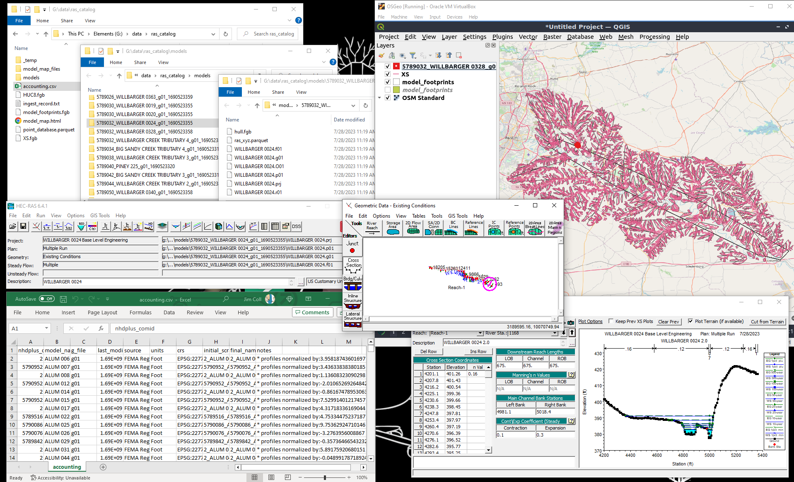
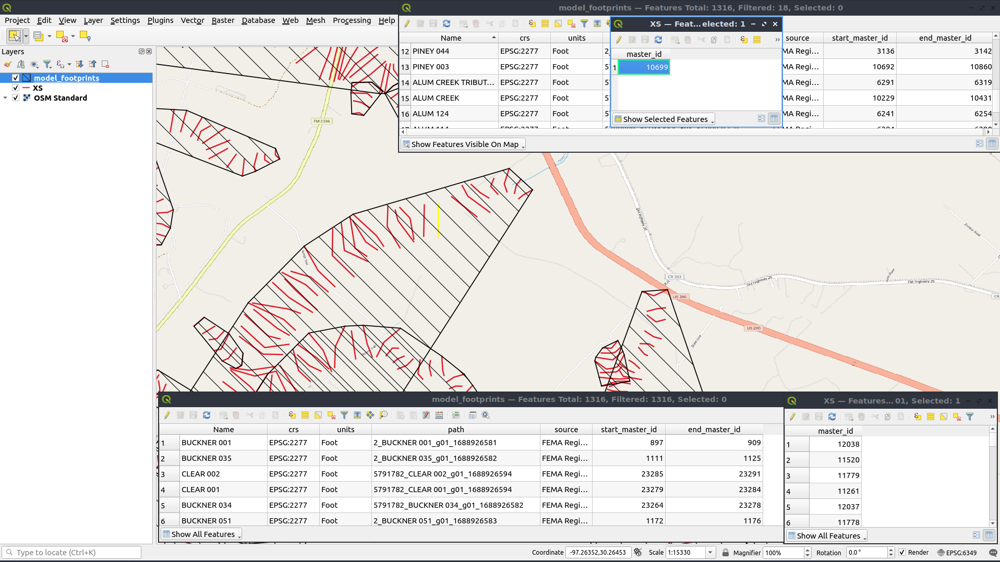
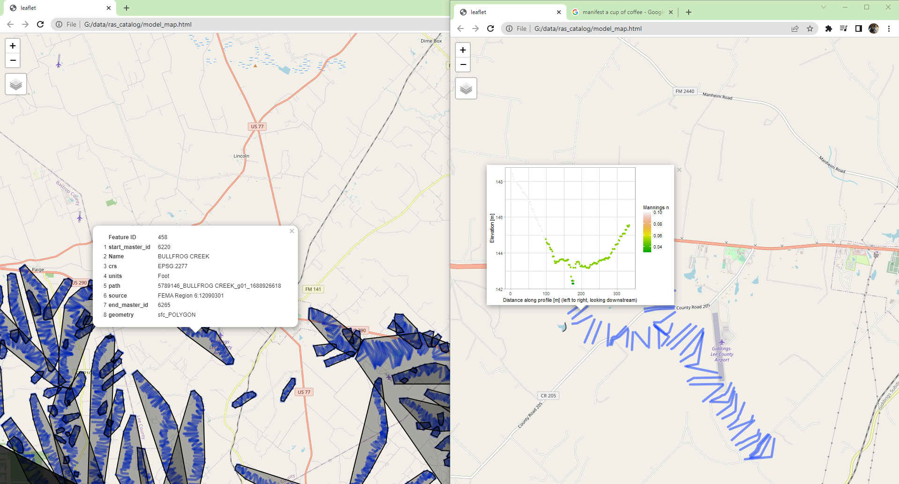

The primary use of RRASSLER is to spin out a accountable set of models.  This "database" has a consistent structure and the herein described metadata and assorted sidecar files which make that data more FAIR.

## Model Catalog

Users may look at the _model_catalog.csv_'s, and the models underneath, but should avoid manual manipulation of individual files, paths, or other aspects.  RRASSLER scripts will do all needed manipulation, file sorting, and cataloging for you but there is very limited error checking should the workflow be applied incorrectly.  As a general rule of thumb, once you've selected your destination for the catalog, only manipulate the csv, preferably _never_ with EXCEL, which may chew up data along edge cases.

## "post-processing"

There is not really a delineation between processing steps within RRASSLER, ones the files have been placed into the RRASSL'd structure the bulk of the work is done but it would be nice if we could put a spatial index and tracking sheet together programatically.  That is what these final steps accomplish, parsing out the different units and RRASSL'd metadata and placing them in single files which makes them more findable.  There are two primary parts to post-processing: Generating catalog indicies and mapping utilities.

### 1A) If you need to pick up after a previous run make sure you set your catalog location appropritly
## Internal to the package
```{r, eval = FALSE}
ras_dbase <- "/inst/extdata/sample_output/ras_catalog/"
```

## A Local path
```{r, eval = FALSE}
ras_dbase <- file.path("~/data/ras_catalog/")
```

## Or set a cloud account and path up like so:
```{r, eval = FALSE}
Sys.setenv("AWS_ACCESS_KEY_ID" = "AKIASUPERSECRET","AWS_SECRET_ACCESS_KEY" = "evenmoresecret","AWS_DEFAULT_REGION" = "us-also-secret")
ras_dbase <- "s3://ras-models/"
```


### 1) Remerge the generated catalog index

```{r, eval=FALSE}
refresh_master_files(path_to_ras_dbase = ras_dbase,is_verbose = TRUE)
```

This will create or recreate the index files at the top of the catalog, including:  

* The Accounting sheet: _accounting.csv_ 
* Model footprints: _model_footprints.fgb_  
* Cross sections: _XS.fgb_  
* Points: _point_database.parquet_  



#### What did that make?

As mentioned, the form of the RRASSL'd record is based on hydrofabric specifications with modifications based on the nature of HEC-RAS data as outlined [with Next Gen hydrofabric parameters](https://noaa-owp.github.io/hydrofabric/articles/cs_dm.html).  These are augmented by RAS specific attributes as defined in our standing [data model page](https://noaa-owp.github.io/hydrofabric/articles/RRASSLER-format.html).  See the RRASSLER specific data model page [here](https://NOAA-OWP.github.io/RRASSLER/docs/articles/RRASSLER-format.html).  Slightly more tangibly, when RRASSLER has been run all the way through, you'll have access to the index files which you can query (in R) like so:

```{r, eval=FALSE}
cat_path <- path/to/catalog

> points <- arrow::read_parquet(file.path(cat_path,"point_database.parquet",fsep = .Platform$file.sep))
> points
         xid    xid_length      xid_d         x        y         z    n source master_id
      1:   1  231.8369 [m]    0.00000 -97.29359 29.98529 137.83666 0.05      3         1
      2:   1  231.8369 [m]    0.85344 -97.29358 29.98528 137.83666 0.05      3         1
      3:   1  231.8369 [m]    2.56032 -97.29358 29.98527 137.68426 0.05      3         1
      4:   1  231.8369 [m]    4.23672 -97.29357 29.98525 137.62330 0.05      3         1
      5:   1  231.8369 [m]    6.79704 -97.29356 29.98523 137.47699 0.05      3         1
      
> cross_sections <- sf::st_read(file.path(cat_path,"xs.fgb",fsep = .Platform$file.sep))
Reading layer `XS' from data source `/.../RRASSLER/inst/extdata/sample_output/ras_catalog/XS.fgb' using driver `FlatGeobuf'
Simple feature collection with 24901 features and 1 field
Geometry type: LINESTRING
Dimension:     XY
Bounding box:  xmin: -97.60178 ymin: 29.69069 xmax: -96.44944 ymax: 30.41321
Geodetic CRS:  NAD83(2011) + NAVD88 height
> cross_sections
Simple feature collection with 24901 features and 1 field
Geometry type: LINESTRING
Dimension:     XY
Bounding box:  xmin: -97.60178 ymin: 29.69069 xmax: -96.44944 ymax: 30.41321
Geodetic CRS:  NAD83(2011) + NAVD88 height
First 5 features:
   master_id                       geometry
1      12038 LINESTRING (-96.50289 29.71...
2      11520 LINESTRING (-96.50289 29.71...
3      11779 LINESTRING (-96.50289 29.71...
4      11261 LINESTRING (-96.50289 29.71...
5      12037 LINESTRING (-96.48813 29.73...

> footprints <- sf::st_read(file.path(cat_path,"model_footprints.fgb",fsep = .Platform$file.sep))
Reading layer `model_footprints' from data source `/.../RRASSLER/inst/extdata/sample_output/ras_catalog/model_footprints.fgb' using driver `FlatGeobuf'
Simple feature collection with 1316 features and 7 fields
Geometry type: POLYGON
Dimension:     XY
Bounding box:  xmin: -97.60178 ymin: 29.69069 xmax: -96.44944 ymax: 30.41321
Geodetic CRS:  WGS 84
> footprints
Simple feature collection with 1316 features and 7 fields
Geometry type: POLYGON
Dimension:     XY
Bounding box:  xmin: -97.60178 ymin: 29.69069 xmax: -96.44944 ymax: 30.41321
Geodetic CRS:  WGS 84
First 5 features:
   start_master_id        Name       crs units                               path        source end_master_id                       geometry
1              897 BUCKNER 001 EPSG:2277  Foot       2_BUCKNER 001_g01_1688926581 FEMA Region 6           909 POLYGON ((-96.58433 29.7028...
2             1111 BUCKNER 035 EPSG:2277  Foot       2_BUCKNER 035_g01_1688926582 FEMA Region 6          1125 POLYGON ((-96.53977 29.7482...
3            23285   CLEAR 002 EPSG:2277  Foot   5791782_CLEAR 002_g01_1688926594 FEMA Region 6         23291 POLYGON ((-96.54638 29.7554...
4            23279   CLEAR 001 EPSG:2277  Foot   5791782_CLEAR 001_g01_1688926594 FEMA Region 6         23284 POLYGON ((-96.55299 29.7509...
5            23264 BUCKNER 034 EPSG:2277  Foot 5791782_BUCKNER 034_g01_1688926582 FEMA Region 6         23278 POLYGON ((-96.55418 29.7420...
                                                                                                                        
> accounting <- data.table::fread(file.path(ras_dbase,"accounting.csv",fsep = .Platform$file.sep))
> accounting 
   nhdplus_comid     model_name g_file last_modified      source         units        crs                   initial_scrape_name                        final_name_key                                                    notes
           <int>         <char> <char>         <int>      <char>        <char>     <char>                                <char>                                <char>                                                   <char>
1:       5789080       ALUM 107    g01    1691071096 test: FEMA6 English Units  EPSG:2277       5789080_ALUM 107_g01_1691071096       5789080_ALUM 107_g01_1691071096       * profiles normalized by:7.091436580325 * G parsed
2:       5789080       ALUM 114    g01    1691071096 test: FEMA6 English Units  EPSG:2277       5789080_ALUM 114_g01_1691071096       5789080_ALUM 114_g01_1691071096  * profiles normalized by:5.65206610852312 * GHDF parsed
3:       5790952       ALUM 006    g01    1691071095 test: FEMA6 English Units  EPSG:2277       5790952_ALUM 006_g01_1691071095       5790952_ALUM 006_g01_1691071095   * profiles normalized by:3.9480012459621 * GHDF parsed
4:       7242483        7242449    g01    1634841246   test: IFC      SI Units EPSG:26915        7242483_7242449_g01_1634841246        7242483_7242449_g01_1634841246 * profiles normalized by:0.317587652014083 * GHDF parsed
5:       7242511        7242483    g01    1634841246   test: IFC      SI Units EPSG:26915        7242511_7242483_g01_1634841246        7242511_7242483_g01_1634841246 * profiles normalized by:-18.1052610894281 * GHDF parsed
6:       7242531        7242511    g01    1634841246   test: IFC      SI Units EPSG:26915        7242531_7242511_g01_1634841246        7242531_7242511_g01_1634841246 * profiles normalized by:-17.6133415418126 * GHDF parsed
7:       7242581 10170204000897    g01    1616607646   test: IFC      SI Units EPSG:26915 7242581_10170204000897_g01_1616607646 7242581_10170204000897_g01_1616607646    * profiles normalized by:-64.1121224975974 * G parsed
8:       7242581        7242531    g01    1634841246   test: IFC      SI Units EPSG:26915        7242581_7242531_g01_1634841246        7242581_7242531_g01_1634841246    * profiles normalized by:-11.2094011902594 * G parsed
9:       7242581        7242581    g01    1634841246   test: IFC      SI Units EPSG:26915        7242581_7242581_g01_1634841246        7242581_7242581_g01_1634841246    * profiles normalized by:-29.0414282453886 * G parsed                                                                                                                     
```

or like so if python is your preferred tooling:

```{md, eval=FALSE}
import os
import pandas
import geopandas
import pyarrow.parquet

cat_path = path/to/catalog
points = pandas.read_parquet(os.path.join(cat_path, 'point_database.parquet'), engine='pyarrow')
points
 	xid 	xid_length 	xid_d 	relative_dist 	x 	y 	z 	n 	source 	master_id
0 	1 	282.819375 	0.00000 	0.000000 	-97.228405 	30.209038 	180.481224 	0.16 	3.0 	1.0
1 	1 	282.819375 	1.92024 	0.006790 	-97.228416 	30.209023 	180.206904 	0.16 	3.0 	1.0
2 	1 	282.819375 	3.99288 	0.014118 	-97.228428 	30.209007 	180.161184 	0.16 	3.0 	1.0
3 	1 	282.819375 	5.76072 	0.020369 	-97.228438 	30.208994 	179.947824 	0.16 	3.0 	1.0
4 	1 	282.819375 	8.74776 	0.030931 	-97.228454 	30.208971 	179.767992 	0.16 	3.0 	1.0

cross_sections = geopandas.read_file(os.path.join(cat_path, 'model_footprints.fgb'))
cross_sections
master_id 	geometry
0 	38.0 	LINESTRING (-96.00866 43.37436, -96.00866 43.3...
1 	85.0 	LINESTRING (-96.00866 43.37436, -96.00866 43.3...
2 	86.0 	LINESTRING (-96.01016 43.37394, -96.01017 43.3...
3 	39.0 	LINESTRING (-96.01016 43.37394, -96.01017 43.3...
4 	87.0 	LINESTRING (-96.01221 43.37459, -96.01222 43.3...

footprints = geopandas.read_file(os.path.join(cat_path, 'model_footprints.fgb'))
footprints
id 	start_master_id 	model_name 	crs 	units 	final_name_key 	source 	end_master_id 	geometry
0 	1 	38.0 	7242449 	EPSG:26915 	SI Units 	7242483_7242449_g01_1634841246 	test: IFC 	49.0 	POLYGON ((-96.00866 43.37436, -96.00866 43.374...
1 	1 	50.0 	7242483 	EPSG:26915 	SI Units 	7242511_7242483_g01_1634841246 	test: IFC 	71.0 	POLYGON ((-96.02147 43.37233, -96.02148 43.372...
2 	1 	85.0 	10170204000897 	EPSG:26915 	SI Units 	7242581_10170204000897_g01_1616607646 	test: IFC 	146.0 	POLYGON ((-96.00866 43.37436, -96.00866 43.374...
3 	1 	72.0 	7242511 	EPSG:26915 	SI Units 	7242531_7242511_g01_1634841246 	test: IFC 	84.0 	POLYGON ((-96.04800 43.35928, -96.04802 43.359...
4 	1 	147.0 	7242531 	EPSG:26915 	SI Units 	7242581_7242531_g01_1634841246 	test: IFC 	158.0 	POLYGON ((-96.05628 43.35093, -96.05632 43.350...
5 	1 	159.0 	7242581 	EPSG:26915 	SI Units 	7242581_7242581_g01_1634841246 	test: IFC 	177.0 	POLYGON ((-96.06632 43.34152, -96.06633 43.341...

accounting = pandas.read_csv(os.path.join(ras_dbase,"accounting.csv"))
accounting
	nhdplus_comid 	model_name 	g_file 	last_modified 	source 	units 	crs 	initial_scrape_name 	final_name_key 	notes
0 	5789080 	ALUM 107 	g01 	1691071096 	test: FEMA6 	English Units 	EPSG:2277 	5789080_ALUM 107_g01_1691071096 	5789080_ALUM 107_g01_1691071096 	* profiles normalized by:7.091436580325 * G pa...
1 	5789080 	ALUM 114 	g01 	1691071096 	test: FEMA6 	English Units 	EPSG:2277 	5789080_ALUM 114_g01_1691071096 	5789080_ALUM 114_g01_1691071096 	* profiles normalized by:5.65206610852312 * GH...
2 	5790952 	ALUM 006 	g01 	1691071095 	test: FEMA6 	English Units 	EPSG:2277 	5790952_ALUM 006_g01_1691071095 	5790952_ALUM 006_g01_1691071095 	* profiles normalized by:3.9480012459621 * GHD...
3 	7242483 	7242449 	g01 	1634841246 	test: IFC 	SI Units 	EPSG:26915 	7242483_7242449_g01_1634841246 	7242483_7242449_g01_1634841246 	* profiles normalized by:0.317587652014083 * G...
4 	7242511 	7242483 	g01 	1634841246 	test: IFC 	SI Units 	EPSG:26915 	7242511_7242483_g01_1634841246 	7242511_7242483_g01_1634841246 	* profiles normalized by:-18.1052610894281 * G...
```

If you need a refresher on what those field mean, check back on the [RRASSLER Data Model](https://NOAA-OWP.github.io/RRASSLER/articles/RRASSLER-format.html) page.

3) Create a handy map to view

```{r, eval=FALSE}
RRASSLER::map_library(path_to_ras_dbase = ras_dbase,AOI_to_map = NULL,name = "model_map",plot_lines = TRUE,chart_lines = FALSE,refresh = FALSE,quiet = FALSE)
```

This function will create a stand alone leaflet map which is useful in "interactively" exploring the data, facilitating simple queries, and inspirational presentations.  Just double click on the generated html document (model_map.html) to view it in your web browser



### Extend database for ras2fim deployments

RAS2FIM pipelines are looking for a few extra helpers in order to pipeline these models through the workflow.  To generate the needed catalog, use the following function.

```{r, eval=FALSE}
RRASSLER::append_catalog_fields(path_to_ras_dbase = ras_dbase,out_name = "OWP_ras_model_catalog.csv",overwrite = FALSE,is_quiet = TRUE)
```

Congratulations!  You now have a RRASSLER catalog and all the pieces needed to make HEC-RAS model data more FAIR and amenable to operational accounting and use.
